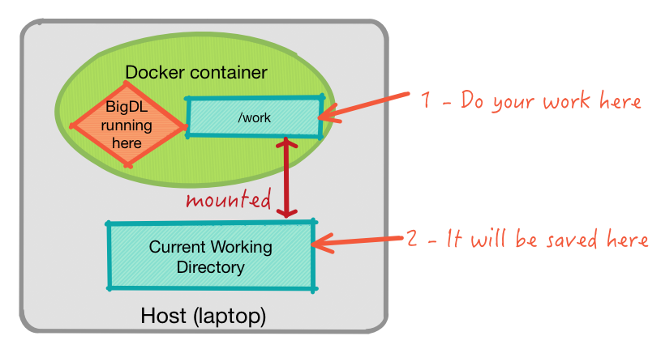

# BigDL Tutorials


This repository contains tutorials and examples of Intel BigDL software.

## Contents
- [About BigDL](#about)
- [Tutorials](#autorials)
- [Running BigDL](#running)
- [Building Docker container](#building)


## About BigDL
BigDL is a Deep Learning framework.  
TODO add more.  
You can find more below
- [BigDL product page](https://software.intel.com/en-us/articles/bigdl-distributed-deep-learning-on-apache-spark)
- [BigDL @ Github](https://github.com/intel-analytics/BigDL)

## Tutorials
- [Tutorial 1](tutorials/tutorial1.md)
- [Tutorial 2](tutorials/tutorial2.md)

## Running
We have an easy to use Docker container with BigDL and all dependencies and utilities needed.

#### Step 1:
Install [Docker](https://www.docker.com/) for your platform

#### Step 2:
Download [this repository](https://github.com/elephantscale/bigdl-tutorials) to your machine.  
You can either use
```
    $    git clone https://github.com/elephantscale/bigdl-tutorials
```
or download the repository as a zip file and unzip it.

#### Step 3:
Go into your directory and launch the following command
```
    $    ./run-bigdl-docker.sh   bigdl/bigdl
    # $    ./run-bigdl-docker.sh   <image id>
```
This will launch the Docker container and run Jupyter notebook

#### Step 4:
Go to Jupyter notebook url displayed on the console, it will look like
`http://localhost:8888?token=abcdef12345`

#### Step 5:
Navigate to `work` directory and you will see notebook tutorials.

Note : Please do all the work in the `work` directory.  Any work you do in `work` directory will be saved automatically on your machine.  And the changes will be available even after Docker container has exited.




## Building
If you'd like to build your own version of Docker container, please see instructions in [docker/README.md](docker/README.md)
